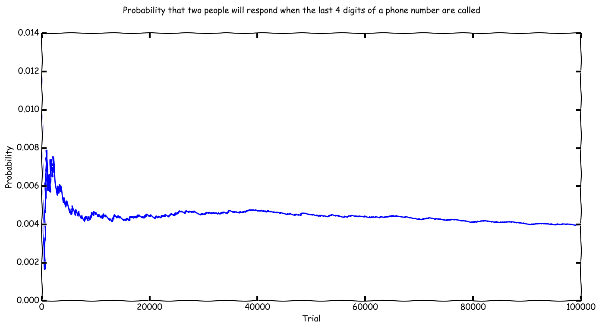

# ExperimentalScripts
Some things I've written to solve problems or satisfy curiosity

-----
#KaplanMeierDrugLitAssignment

An assignement in my drug literature class required us to graph kaplan meier curves for two groups of patients.
I did it in python using the lifelines library.
I just removed the censored patients because I didn't have time to handle them in the graph.
-----
#SOSprobGraph.py

Same as below, except it just runs for 100,000 iterations and outputs a graph. Oh and the loop runs about 11x faster.

-----
#SOS_queue_prob.py

I was waiting in line at the secretary of state. The staff call out the last 4 digits of your phone number when it is your turn.
There are currently 40 people in line. 
What is the probability that, when a number is called, two or more people will have the same number?
Assuming that each number has an equal probability.
This runs a monte carlo simulation because I am lazy and my computer is not.

-----
#AccessIDscrape

A script that I wrote to find everyone in my PharmD class's school ID from my university's directory.
Works pretty good, except for the people who haven't updated their program designation to say "Doctor of Pharmacy"
also it accidentally grabs the people's names from other class years that unfortuitously 1)Return as a hit from the search AND 2)Also happen to be in to be in the pharmacy program.

-----

#NucleiClusterSegmentation
A StackOverflow answer I wrote to solve a problem of clustering and segmenting groups of bunched cell nuclei

http://stackoverflow.com/questions/38271928/imaging-processing-clustering-cells-into-groups-in-fly-embryos-images/38839674#38839674

-----

#FileEncryptor.py

Terminal/cmd file encryptor (AES)

This is just a toy/ thing I was messing with

Requires:

Python 3 PyCrypto

Simply run in the command prompt/terminal and follow instructions

Use E to encrypt, D to decrypt. Make sure to type the complete file path. However, if the file to be encrypted is in the same folder as FileEncryptor.py, it is only necessary to type the filename.

-----

#CoinFlip.py

Returns heads or tails with equal probability when the function is called

-----

#MonteCarloChildren.py

Runs a Monte Carlo simulation to determine the probability that at least one child will be a girl.
The function accepts numbers of simulation runs and the number of children you plan on having.

Basically, it validates 1 - (Pr * n)
